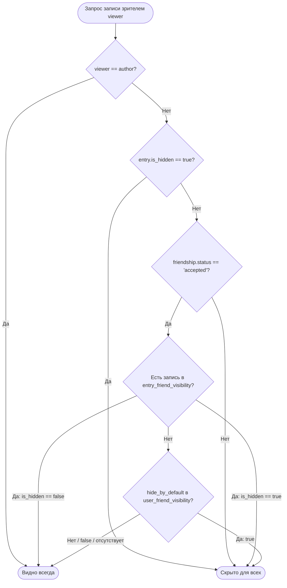

# MOODILA (MoodShare) — AI AGENT CONTEXT & PROJECT BLUEPRINT

Этот документ — главный источник архитектурного, технического и функционального контекста проекта **Moodila** (ранее MoodShare). Документ спроектирован так, чтобы любой ИИ-агент или разработчик в новой сессии мгновенно получил полное понимание кодовой базы, бизнес-логики, схемы данных и правил внесения изменений.

---

## 1. Обзор проекта (Project Overview)

**Moodila** — это кроссплатформенное мобильное PWA-приложение (React 19 + Vite + Tailwind CSS + Go API) для ведения персонального дневника настроения и дня с глубокой социальной составляющей и продвинутой аналитикой.

### Статус проекта:
- **Фаза:** Feature-Complete / Production-Ready MVP.
- **Основные возможности:**
  - 📝 **Дневник настроения и дня:** Оценка настроения (шкала 1–5: Rad, Good, Meh, Bad, Awful), категоризированные теги (*Positive*, *Neutral*, *Difficult*), авторасширяемый текст с лимитом символов, прикрепление фото через S3 Presigned URLs и запись/воспроизведение голосовых заметок (*Voice Notes*).
  - 🔒 **Двухуровневая система приватности (Friend Visibility):** Глобальное скрытие (`is_hidden`), аккаунт-дефолты скрытия от конкретных друзей (`user_friend_visibility`), точечные исключения/оверрайды на уровне конкретной записи (`entry_friend_visibility`).
  - 📅 **Интерактивный календарь:** Просмотр своего календаря и календарей друзей по месяцам, цветовые маркеры настроений, бейджи кастомной приватности, месячная сводка (доминирующее настроение, топ-тег), инспектор дня в модальном окне со свайп-жестами на мобильных устройствах.
  - 📊 **Глубокая аналитика и инсайты (`/stats`):** Фильтры по периодам (неделя, месяц, год, все время), тренд средней оценки, тепловая карта по дням недели, распределение настроений, корреляция тегов с настроением, алгоритмические персонализированные инсайты с мультиязычной шаблонизацией.
  - 👥 **Социальный граф:** Поиск пользователей с дебаунсом, система заявок в друзья (*pending / accept / decline / cancel*), профили друзей с их открытыми записями и статистикой.
  - 📰 **Социальная лента (Feed):** Общая хронологическая лента нескрытых записей друзей, мульти-реакции (эмодзи), комментарии с поддержкой удаления автором поста или автором комментария.
  - 🔔 **Уведомления и Web Push:** Центр уведомлений (бейдж на колокольчике, фильтр непрочитанных, мгновенная отметка прочитанным), системные Web Push уведомления по стандарту VAPID.
  - 📢 **Системные анонсы и Admin-панель:** Создание, редактирование, публикация и архивация объявлений администратором (`/admin`), глобальная очередь отображения непрочитанных анонсов для пользователей (`AnnouncementQueue`).
  - 🛡️ **Безопасность и аккаунт:** JWT-авторизация с версионированием токенов (`token_version` для мгновенной инвалидации всех сессий), защита от CSRF, многоуровневый Rate Limiting, восстановление пароля и подтверждение удаления аккаунта через одноразовые токены на почту (Resend API).
  - ☁️ **Автобэкапы:** Фоновый планировщик бэкапов PostgreSQL в Google Drive с поддержкой OAuth2 Refresh Token / Service Account и автоматической ротацией по сроку давности.
  - 📳 **Тактильный отклик (Haptic Feedback):** Нативная тактильная отдача для мобильных устройств на базе Web Vibration API с поддержкой iOS Safari и PWA через полифил `ios-vibrator-pro-max` (паттерны для навигации, настроений, сохранения, удаления, реакций и записи аудио с тумблером в профиле).
  - 🌐 **Локализация и темы:** Полная поддержка русского (`ru`) и английского (`en`) языков, темная и светлая темы с сохранением в `localStorage`.

---

## 2. Технический стек (Tech Stack)

### Backend (Go)
| Компонент | Технология | Описание |
|---|---|---|
| **Язык** | Go `1.24` / `1.25` | Модуль `moodshare` (`backend/go.mod`) |
| **HTTP-фреймворк** | [Gin](https://github.com/gin-gonic/gin) `v1.10.1` | Высокопроизводительный роутинг и middleware |
| **СУБД** | PostgreSQL (Supabase / AWS RDS / Local) | Реляционная БД |
| **Драйвер БД** | [`pgx/v5`](https://github.com/jackc/pgx) | Пул соединений `pgxpool.Pool`, чистый SQL без ORM |
| **Безопасность** | `golang-jwt/jwt/v5`, `golang.org/x/crypto/bcrypt` | JWT (Access/Refresh), bcrypt хеширование, CSRF-токены |
| **Rate Limiting** | `golang.org/x/time/rate` | Token Bucket лимитеры по IP или ID пользователя |
| **Файловое хранилище** | `aws-sdk-go-v2` (S3 / Cloudflare R2 / MinIO) | Генерация Presigned PUT/GET URLs, нормализация ключей объектов |
| **Web Push** | [`webpush-go`](https://github.com/SherClockHolmes/webpush-go) | Стандарт VAPID для отправки пушей в браузер |
| **Транзакционная почта** | [Resend Go SDK](https://github.com/resend/resend-go) | Отправка писем сброса пароля и удаления аккаунта (логгирование в dev) |
| **Резервное копирование** | `google.golang.org/api/drive/v3` | Фоновый крон выгрузки SQL-дампов в папку Google Drive |
| **Мониторинг** | [`sentry-go`](https://github.com/getsentry/sentry-go) + Gin | Отслеживание паник, необработанных сбоев API и трейсинг |

### Frontend (React / PWA)
| Компонент | Технология | Описание |
|---|---|---|
| **Фреймворк / Сборщик** | React 19 (`^19.2.7`), Vite 8 (`^8.1.1`) | Чистый SPA с ES Modules и поддержкой Fast Refresh |
| **Роутинг** | React Router DOM 7 (`^7.18.1`) | Декларативный роутинг с `lazy` загрузкой экранов |
| **Сетевой слой и кеш** | TanStack React Query v5 (`^5.101.4`) | Кеширование, фоновая синхронизация, optimistic updates |
| **Стилизация** | Tailwind CSS 3 (`^3.4.19`) + `index.css` | Дизайн-токены, CSS-переменные для темной/светлой темы |
| **PWA** | `vite-plugin-pwa` (`^1.3.0`) + Workbox | Офлайн-кеширование статики, Service Worker для Web Push |
| **iOS Тактильность** | `ios-vibrator-pro-max` (`^3.0.3`) | Полифил Web Vibration API (`navigator.vibrate`) для iOS Safari и PWA |
| **Линтер** | Oxlint (`^1.71.0`) | Сверхбыстрый линтинг JavaScript/JSX |
| **UI Утилиты** | `react-easy-crop` (`^6.2.3`) | Интерактивный кроп аватаров перед отправкой в S3 |
| **Мониторинг** | `@sentry/react` (`^10.70.0`) + `@sentry/vite-plugin` | Отслеживание клиентских ошибок, Error Boundary, source maps |

---

## 3. Архитектура и структура директорий (Project Structure)

```text
moodila/
├── AGENTS.MD                        # Этот документ — главный контекстный гайд
├── PLAN_FRIEND_VISIBILITY.md        # Детальный архитектурный план системы приватности
├── backend/
│   ├── cmd/
│   │   ├── api/main.go              # Точка входа API: инициализация БД, миграций, сервисов, роутов и graceful shutdown
│   │   ├── backup/main.go           # CLI-утилита для ручного запуска бэкапа БД
│   │   ├── migrate/main.go          # CLI-утилита для отдельного прогона миграций
│   │   ├── token/main.go            # Утилита генерации OAuth2 Refresh Token для Google Drive
│   │   └── verify_keys/main.go      # Утилита проверки валидности VAPID-ключей
│   ├── internal/
│   │   ├── backup/                  # Фоновый планировщик бэкапов в Google Drive (Gdrive API, pg_dump)
│   │   ├── config/                  # Загрузка и валидация конфигурации из переменных окружения
│   │   ├── db/                      # Инициализация pgxpool и встроенный мигратор SQL
│   │   ├── handlers/                # HTTP-хендлеры (auth, entries, friends, feed, notifications, push, stats, storage, users, announcements, health)
│   │   ├── mailer/                  # Клиент Resend с HTML-шаблонами и dev-fallback
│   │   ├── middleware/              # Auth (JWT + token_version), CSRF, Admin, RateLimit, CORS, Logger
│   │   ├── models/                  # Структуры данных (User, Entry, CalendarEntry, Friend, Feed, Notification, Stats, Announcement, etc.)
│   │   ├── repository/              # Data Access Layer: чистые SQL-запросы к PostgreSQL и in-memory кеш SummaryCache
│   │   ├── services/
│   │   │   └── push/                # Web Push сервис (VAPID ключи, подписка, рассылка)
│   │   └── storage/                 # S3-совместимый клиент хранилища (генерация Presigned URLs, удаление)
│   ├── migrations/                  # 15 SQL-миграций (0001–0015)
│   ├── .env.example                 # Шаблон переменных окружения бэкенда
│   └── go.mod / go.sum
├── frontend/
│   ├── public/                      # Иконки PWA, манифест, sw-push.js
│   ├── src/
│   │   ├── api/                     # Сетевой слой:
│   │   │   ├── client.js            # Fetch-клиент с авторизацией Bearer, CSRF-токенами и авто-рефрешем
│   │   │   ├── queryKeys.js         # Централизованные фабрики ключей React Query
│   │   │   ├── queries.js           # Кастомные хуки React Query (запросы и мутации)
│   │   │   ├── auth.js, entries.js, feed.js, friends.js, notifications.js, push.js, users.js, announcements.js
│   │   ├── components/              # Переиспользуемые UI-компоненты:
│   │   │   ├── BottomNav.jsx        # Нижняя навигационная панель мобильного вида
│   │   │   ├── DesktopSidebar.jsx   # Боковая панель для десктопного вьюпорта
│   │   │   ├── HeaderBell.jsx       # Колокольчик уведомлений с бейджем
│   │   │   ├── NotificationCenterModal.jsx # Шторка/модалка центра уведомлений
│   │   │   ├── FriendPrivacyModal.jsx # Управление дефолтной и точечной видимостью для друзей
│   │   │   ├── VoiceNotePlayer.jsx  # Аудио-плеер с единым контролем через audioManager
│   │   │   ├── AvatarCropModal.jsx  # Модалка кропа аватаров
│   │   │   ├── DatePickerModal.jsx  # Интерактивный выбор даты
│   │   │   ├── ReactionsModal.jsx   # Выбор эмодзи-реакций
│   │   │   ├── DeleteAccountModal.jsx, ChangePasswordForm.jsx, AnnouncementQueue.jsx, etc.
│   │   ├── context/
│   │   │   ├── LanguageContext.jsx  # Контекст переключения языка (ru / en)
│   │   │   └── ThemeContext.jsx     # Контекст темы (dark / light)
│   │   ├── hooks/
│   │   │   ├── useDebounce.js       # Дебаунс значений (поиск друзей)
│   │   │   └── useModalKeyboard.js  # Доступность модалок (ESC, Tab-фокус)
│   │   ├── i18n/
│   │   │   ├── ru.js                # Русская локализация
│   │   │   └── en.js                # Английская локализация
│   │   ├── pages/                   # Страницы приложения (Home, AddEntry, Calendar, Stats, Friends, FriendProfile, Feed, Profile, Admin, Landing, Auth, etc.)
│   │   ├── utils/                   # Утилиты (audioManager, moods, navigation, cropImage, offlineStore, haptics с iOS-полифилом)
│   │   ├── App.jsx / main.jsx       # Конфигурация роутинга и провайдеров
│   │   └── index.css                # Глобальные стили Tailwind
│   ├── package.json
│   ├── tailwind.config.js
│   └── vite.config.js
└── design-reference/                # Дизайн-система (DESIGN.md и HTML-мокапы)
```

---

## 4. Схема базы данных и миграции (`backend/migrations/`)

Все миграции встраиваются в бинарник через `embed.FS` и выполняются строго по порядку номеров при старте сервера:

1. **`0001_create_users.sql`** — Таблица `users`:
   - `id` (UUID PK), `email` (UNIQUE), `password_hash`, `username` (UNIQUE), `display_name`, `avatar_url`, `created_at`.
2. **`0002_create_entries.sql`** — Таблица `entries`:
   - `id` (UUID PK), `user_id` (FK users), `date` (DATE), `mood` (INT 1–5), `tags` (`TEXT[]`), `text`, `photo_url`, `is_hidden` (BOOLEAN DEFAULT false), `created_at`.
   - Уникальный составной индекс: `UNIQUE(user_id, date)`.
3. **`0003_create_friendships.sql`** — Таблица `friendships`:
   - `id` (UUID PK), `requester_id` (FK users), `addressee_id` (FK users), `status` (`pending`, `accepted`, `declined`), `created_at`, `updated_at`.
4. **`0004_create_likes.sql`** — Таблица `likes`:
   - `id` (UUID PK), `entry_id` (FK entries CASCADE), `user_id` (FK users CASCADE), `created_at`.
5. **`0005_create_comments_and_reactions.sql`** — Таблицы `comments` и `entry_reactions`:
   - Поддержка комментариев и реакций к записям ленты.
6. **`0006_create_notifications.sql`** — Таблица `notifications`:
   - `id`, `user_id` (получатель), `actor_id` (инициатор), `type` (`friend_request`, `friend_accept`, `like`, `comment`, `reaction`), `entity_id`, `is_read`, `created_at`.
7. **`0007_add_audio_to_entries.sql`** — Расширение `entries`:
   - Добавлены колонки `audio_url` (TEXT) и `audio_duration` (INT в секундах).
8. **`0008_create_announcements.sql`** — Таблицы `announcements` и `announcement_reads`:
   - Системные анонсы (заголовок, тело, статус `draft`/`published`/`archived`, `published_at`) и учет прочтений пользователями.
9. **`0009_create_password_reset_tokens.sql`** — Таблица `password_reset_tokens`:
   - Хранение одноразовых криптографических токенов сброса пароля (`token_hash`, `expires_at`, `used_at`).
10. **`0010_create_account_deletion_tokens.sql`** — Таблица `account_deletion_tokens` и поле `deleted_at` в `users`:
    - Поддержка безопасного удаления/анонимизации аккаунтов.
11. **`0011_add_user_token_version.sql`** — Поле `token_version` (INT NOT NULL DEFAULT 0) в `users`:
    - Инкрементируется при смене пароля или выходе со всех устройств, что мгновенно аннулирует старые JWT.
12. **`0012_create_push_subscriptions.sql`** — Таблица `push_subscriptions`:
    - `id`, `user_id`, `endpoint` (UNIQUE), `p256dh`, `auth`, `created_at`.
13. **`0013_multiple_reactions.sql`** — Индексы и расширения для поддержки множественных типов эмодзи-реакций на запись.
14. **`0014_unify_storage_object_keys.sql`** — Нормализация путей объектов S3:
    - Структура ключей: `users/{user_id}/avatars/...`, `users/{user_id}/photos/...`, `users/{user_id}/audio/...`.
15. **`0015_create_friend_visibility.sql`** — Таблицы двухуровневой приватности:
    - `user_friend_visibility`: `(user_id, friend_id, hide_by_default, created_at, updated_at)`.
    - `entry_friend_visibility`: `(entry_id, friend_id, is_hidden, created_at)`.
16. **`0016_create_purge_old_notifications_fn.sql`** — Функция очистки старых уведомлений (`purge_old_notifications`).
17. **`0017_create_notification_settings.sql`** — Таблица `notification_settings` для кастомизации типов push-уведомлений.
18. **`0018_rework_announcements.sql`** — Реворк подсистемы объявлений и админки:
    - Добавлены поля `kind` (`standard` / `onboarding`), `display_type` (`modal` / `banner` / `feed_only`), `expires_at`, `cta_label`, `cta_url`, `is_pinned`.
    - Создана таблица `announcement_user_state` для строгого разделения состояний `dismissed_at` (скрыть прерывающий интерфейс) и `read_at` (прочитано в архиве).
    - Базовое правило изоляции истории для новичков: `a.published_at >= u.created_at`.
    - Серверная инварианта `/announcements/active-prompt`: строго не более 1 активного промпта по детерминированному приоритету.
    - CSRF-защита маршрутов `/admin`.

---

## 5. Ключевые подсистемы и бизнес-логика (Core Subsystems)

### 5.1. Двухуровневая система приватности (Friend Visibility)

Приложение позволяет точно контролировать, какие друзья видят конкретные записи.



**Каноническое SQL-условие видимости записи:**
```sql
(e.user_id = $viewer_id)
OR (
    f.status = 'accepted'
    AND e.is_hidden = false
    AND COALESCE(efv.is_hidden, ufv.hide_by_default, false) = false
)
```
- **Инвалидация кеша сводок (`SummaryCache`):** В репозитории `internal/repository/entries.go` реализован `SummaryCache` с поддержкой метода `InvalidateUser(authorID)`, очищающего все кешированные варианты для зрителей при изменении записей или настроек приватности.

---

### 5.2. Аутентификация, токены и безопасность

1. **JWT Auth:** Access-токены содержат `user_id` и `token_version`. Middleware `Auth` сверяет версию токена с БД/кешем. При несовпадении сессия немедленно прекращается.
2. **CSRF Защита:** Все изменяющие состояние запросы (`POST`, `PUT`, `PATCH`, `DELETE`) проверяют заголовок `X-CSRF-Token` и соответствующую cookie.
3. **Rate Limiting:**
   - Auth (логин/регистрация): 5 зап. / 12 сек.
   - Сброс пароля: 1 зап. / 60 сек.
   - Загрузка файлов (S3): 10 зап. / 4 сек.
   - Мутации (создание/изменение записей): 15 зап. / 2 сек.
   - Чтение: 30 зап. / 600 мс.
4. **Удаление аккаунта:** Двухэтапный процесс. Запрос из интерфейса → генерация защищенного токена → ссылка на email → подтверждение на странице `/account/confirm-delete` → анонимизация / soft delete.

---

### 5.3. Записи дневника, фото и голосовые заметки

1. **Создание и редактирование (`AddEntry.jsx` -> `POST /entries`):**
   - Одна запись на одну дату для пользователя (upsert по `user_id + date`).
   - Настроение от 1 (Awful) до 5 (Rad).
   - Теги группируются по категориям (Positive, Neutral, Difficult).
2. **Фото:** Браузер запрашивает у API Presigned URL (`POST /storage/entry-photos/upload-url`) и загружает файл напрямую в S3 по методу `PUT`. В БД сохраняется только публичный URL.
3. **Голосовые заметки (Voice Notes):**
   - Запись через Web MediaRecorder API.
   - Загрузка в S3 через Presigned URL (`POST /storage/entry-audio/upload-url`).
   - Воспроизведение через компонент `VoiceNotePlayer.jsx`, использующий синглтон `audioManager.js` для предотвращения одновременного звучания нескольких треков.

---

### 5.4. Социальный граф, лента и реакции

1. **Друзья (`/friends`):** Поиск других пользователей по `@username`, отправка заявки (`POST /friends/request`), принятие/отклонение/отмена, удаление друга (`DELETE /friends/:id`).
2. **Лента (`Feed.jsx` -> `GET /feed`):**
   - Выводит записи друзей с учетом правил видимости.
   - Поддерживает курсорную пагинацию.
3. **Мульти-реакции и комментарии:**
   - Пользователь может поставить эмодзи-реакцию (`POST /feed/:entry_id/like` с выбором типа реакции) или оставить текстовый комментарий.
   - Автор записи может модерировать и удалять любые комментарии под своим постом.

---

### 5.5. Аналитика и статистика (`Stats.jsx` -> `GET /stats`)

Бэкенд-хендлер `handlers.Stats` и репозиторий `repository.Stats` рассчитывают:
- **Периоды:** `week`, `month`, `year`, `all`.
- **Серия настроений (`mood_series`):** Точки на графике с расчетом среднего настроения за каждый день периода.
- **Тепловая карта (`heatmap_data`):** Матрица активности по дням.
- **Корреляция тегов (`tag_correlation`):** Определение тегов, сильнее всего повышающих (`highest_tag`) или понижающих (`lowest_tag`) настроение.
- **Распределение по дням недели (`day_of_week_averages`):** Среднее настроение с понедельника по воскресенье.
- **Распределение настроений (`mood_distribution`):** Процентное соотношение оценок 1–5.
- **Инсайты (`insights`):** Автоматически сгенерированные выводы с параметрами для локализованной подстановки в UI.

---

### 5.6. Уведомления и Web Push

1. **Центр уведомлений (In-app):**
   - Хендлеры `GET /notifications`, `GET /notifications/unread-count`, `POST /notifications/mark-read`.
   - Модальное окно `NotificationCenterModal.jsx` с фильтрацией «Все / Непрочитанные» и быстрыми действиями (принять заявку в друзья прямо из уведомления).
2. **Web Push:**
   - Frontend регистрирует Service Worker (`public/sw-push.js`), запрашивает VAPID публичный ключ (`GET /notifications/vapid-public-key`) и сохраняет подписку (`POST /notifications/push-subscription`).
   - Бэкенд через `PushSender` отправляет пуши при новых заявках в друзья, лайках и комментариях.

---

### 5.7. Автоматические бэкапы в Google Drive

- Модуль `backend/internal/backup` запускает тикер каждые N часов (`BACKUP_INTERVAL_HOURS`, по умолчанию 3 часа).
- Создает SQL-дамп PostgreSQL, сжимает его и загружает в указанную папку Google Drive (`GDRIVE_FOLDER_ID`).
- Удаляет бэкапы старше `BACKUP_RETENTION_DAYS` (по умолчанию 7 дней).
- Поддерживает работу через персональный Google Drive (OAuth2 Client ID + Secret + Refresh Token) или Service Account.

---

### 5.8. Тактильный отклик и вибрация на смартфонах (Haptic Feedback)

В приложении реализована многоуровневая система тактильного отклика для мобильных устройств через Web Vibration API (`navigator.vibrate`):

- **Модуль `frontend/src/utils/haptics.js`:**
  - Предоставляет набор калиброванных паттернов:
    - `selection()` — ультракороткий клик (10ms) для переключения табов, фильтров, чипов тегов, выбора дней в календаре.
    - `impact()` — отчетливый толчок (25ms) для кнопок настроения (1–5), эмодзи-реакций в ленте, свитчей и основных CTA.
    - `heavy()` — глубокий импульс (45ms) для долгого нажатия (long-press для списка реакций) и вызова ключевых окон.
    - `success()` — восходящий двойной импульс `[15ms, 50ms, 25ms]` для успешного сохранения записи, публикации комментария, принятия заявки в друзья.
    - `warning()` — предупреждающий импульс `[25ms, 40ms, 25ms]` для отклонения/отмены заявок, удаления комментариев, открытия модалок удаления.
    - `error()` — вибросигнал ошибки `[35ms, 40ms, 35ms, 40ms, 50ms]` при непройденной валидации формы или сбое сетевых операций.
    - `recordStart()` / `recordStop()` — тактильная индикация начала и завершения записи голосовой заметки.
    - `vibrate(pattern)` — произвольный вибропаттерн.
- **Безопасная деградация (Graceful Degradation):**
  - Все вызовы обернуты в `try/catch` с предварительной проверкой `isHapticsSupported()`.
  - Безопасно на iOS Safari, десктопах и устройствах без вибромотора — не вызывает ошибок в консоли и сбоев рендеринга.
- **Пользовательский контроль:**
  - Состояние вибрации хранится в `localStorage` по ключу `moodshare_haptics_enabled` (по умолчанию включено).
  - Переключатель «Вибрация и тактильный отклик» доступен в настройках профиля (`/profile`).
  - При переключении диспатчится событие `moodshare_haptics_changed` для мгновенной синхронизации UI без перезагрузки.
- **Точки интеграции:**
  - **Дневник (`AddEntry`):** выбор настроения (1–5), выбор категорий и тегов, старт/стоп аудиозаписи, сохранение записи, удаление.
  - **Навигация (`BottomNav` & `HeaderBell`):** переход по разделам, нажатие главной кнопки «+», открытие шторки уведомлений.
  - **Календарь (`Calendar` & `DatePickerModal`):** выбор ячейки даты, переключение месяцев/недель, свайпы инспектора дня.
  - **Лента (`Feed` & `ReactionsModal`):** тап по эмодзи-реакции, long-press для просмотра списка авторов, отправка/удаление комментария.
  - **Друзья (`Friends` & `FriendPrivacyModal`):** отправка/принятие/отклонение заявок, удаление друга, переключение приватности по умолчанию.
  - **Центр уведомлений (`NotificationCenterModal` & `NotificationSettingsModal`):** тапы по уведомлениям, отметка прочитанными, переключение категорий пушей.
  - **Аудиоплеер (`VoiceNotePlayer`):** воспроизведение/пауза, смена скорости 1x/1.5x/2x, перемотка на таймлайне.

---

## 6. Карта API эндпоинтов (REST API Reference)

### Публичные эндпоинты
| Метод | URL | Описание | Лимит |
|---|---|---|---|
| `GET` | `/health` | Проверка доступности API и подключения к БД | `healthLimiter` |
| `POST` | `/auth/register` | Регистрация нового аккаунта (`email`, `username`, `password`) | `authLimiter` |
| `POST` | `/auth/login` | Вход (`login` / `password`), выдача JWT и CSRF токенов | `authLimiter` |
| `POST` | `/auth/refresh` | Обновление пары токенов | `authLimiter` |
| `POST` | `/auth/forgot-password` | Запрос письма со ссылкой на сброс пароля | `forgotLimiter` |
| `POST` | `/auth/reset-password` | Сброс пароля по токену из письма | `authLimiter` |
| `POST` | `/auth/account/delete-confirm` | Подтверждение удаления аккаунта по токену | `deleteConfirmLimiter` |
| `POST` | `/auth/logout` | Завершение сессии | `mutationLimiter` |

### Защищенные эндпоинты (`Authorization: Bearer <token>` + CSRF)
| Группа | Метод | URL | Описание |
|---|---|---|---|
| **Сессия** | `GET` | `/auth/session` | Проверка валидности сессии и данных текущего пользователя |
| | `PATCH` | `/auth/password` | Смена пароля в профиле |
| | `POST` | `/auth/account/delete-request` | Запрос на удаление аккаунта (отправка письма) |
| **Пользователи** | `GET` | `/users/me` | Получение полного профиля пользователя |
| | `PATCH` | `/users/me` | Обновление `display_name`, `avatar_url` |
| | `GET` | `/users/search?q=...` | Поиск пользователей по username |
| | `GET` | `/users/:id/profile` | Публичный профиль друга с открытыми записями и сводкой |
| **Записи** | `POST` | `/entries` | Создание или обновление записи за дату с оверрайдами |
| | `DELETE`| `/entries/:id` (или `/entries?date=...`) | Удаление записи |
| | `PATCH` | `/entries/:id/visibility` | Быстрое переключение `is_hidden` |
| | `GET` | `/entries/me?date=...` | Получение своей записи за дату (с оверрайдами) |
| | `GET` | `/entries/me?month=...` | Получение своего календаря за месяц |
| | `GET` | `/entries/friend/:friend_id?month=...` | Просмотр открытого календаря друга за месяц |
| | `GET` | `/entries/summary?month=...` | Сводка за месяц (доминирующее настроение, топ-тег) |
| **Статистика**| `GET` | `/stats?period=...` | Расширенная аналитика за период (`week`,`month`,`year`,`all`) |
| **Друзья** | `GET` | `/friends` | Список подтвержденных друзей |
| | `GET` | `/friends/pending` | Список входящих и исходящих заявок |
| | `POST` | `/friends/request` | Отправка заявки в друзья |
| | `POST` | `/friends/accept` | Принятие заявки |
| | `POST` | `/friends/decline` | Отклонение заявки |
| | `POST` | `/friends/cancel` | Отмена отправленной заявки |
| | `DELETE`| `/friends/:id` | Удаление из друзей (с очисткой настроек приватности) |
| | `GET` | `/friends/visibility-defaults` | Получение списка друзей со статусом дефолтного скрытия |
| | `PATCH`| `/friends/:id/visibility-default` | Переключение дефолтного скрытия для конкретного друга |
| **Лента** | `GET` | `/feed?limit=...&cursor=...` | Лента активности друзей |
| | `POST` | `/feed/:entry_id/like` | Поставить/снять реакцию на запись |
| | `GET` | `/feed/:entry_id/reactions` | Список реакций на запись |
| | `GET` | `/feed/:entry_id/comments` | Комментарии к записи |
| | `POST` | `/feed/:entry_id/comments` | Добавить комментарий |
| | `DELETE`| `/feed/comments/:comment_id` | Удалить комментарий |
| **Уведомления**| `GET` | `/notifications` | Список уведомлений |
| | `GET` | `/notifications/unread-count` | Количество непрочитанных событий для бейджа |
| | `POST` | `/notifications/mark-read` | Отметка уведомлений прочитанными |
| | `GET` | `/notifications/settings` | Получение настроек push-уведомлений |
| | `PATCH` | `/notifications/settings` | Обновление настроек push-уведомлений |
| | `GET` | `/notifications/vapid-public-key`| Получение публичного VAPID ключа |
| | `POST` | `/notifications/push-subscription` | Регистрация браузерной Web Push подписки |
| | `DELETE`| `/notifications/push-subscription` | Удаление Web Push подписки |
| **Анонсы** | `GET` | `/announcements/unread` | Получение активных непрочитанных анонсов |
| | `POST` | `/announcements/:id/read` | Отметка анонса прочитанным |
| **Хранилище**| `POST` | `/storage/entry-photos/upload-url` | Presigned URL для загрузки фото |
| | `POST` | `/storage/entry-audio/upload-url` | Presigned URL для загрузки аудио |
| | `POST` | `/storage/delete` | Удаление объекта из хранилища |

### Административные эндпоинты (`/admin/*`, Middleware: `Auth` + `Admin`)
| Метод | URL | Описание |
|---|---|---|
| `GET` | `/admin/announcements` | Полный список анонсов (все статусы) |
| `POST` | `/admin/announcements` | Создание нового анонса |
| `PATCH` | `/admin/announcements/:id` | Редактирование анонса |
| `POST` | `/admin/announcements/:id/publish` | Публикация анонса для пользователей |
| `POST` | `/admin/announcements/:id/archive` | Перевод анонса в архив |

---

## 7. Фронтенд: Маршрутизация, страницы и компоненты

### Карта маршрутов (`frontend/src/App.jsx`)
- `/landing` — Презентационная посадочная страница (Landing Page).
- `/login` — Вход и регистрация (переключение табов).
- `/forgot-password` / `/reset-password` — Восстановление пароля по почте.
- `/account/confirm-delete` — Подтверждение удаления аккаунта.
- `/` (`RootRoute`) — Автоматический редирект на `/home` (если авторизован) или на `/landing` (для гостей).
- `/home` — Главный экран: приветствие, стрик, виджет записи за сегодня, сводка недели.
- `/entries/new` — Экран создания/редактирования записи (эмодзи, теги, текст, фото, аудио, приватность).
- `/calendar` — Интерактивный календарь с переключением на календари друзей и инспектором дня.
- `/stats` — Детальная статистика и аналитика (графики, тепловая карта, инсайты).
- `/friends` — Управление друзьями, заявками, поиск пользователей, модалка приватности.
- `/profile/:id` — Публичный профиль друга с его нескрытыми записями.
- `/feed` — Социальная лента друзей с реакциями и комментариями.
- `/profile` — Настройки профиля, смена аватара, темы, языка, пароля, пушей и удаление аккаунта.
- `/admin` — Панель администратора для управления анонсами.

### Ключевые компоненты UI (`src/components/`):
- `AppLayout.jsx`, `DesktopSidebar.jsx`, `BottomNav.jsx` — Адаптивный каркас приложения (Mobile-First + Desktop sidebar).
- `HeaderBell.jsx` & `NotificationCenterModal.jsx` — Центр уведомлений в виде плавающей шторки с бейджем счетчика.
- `NotificationSettingsModal.jsx` — Управление персональными категориями push-уведомлений.
- `FriendPrivacyModal.jsx` — Модальное окно управления черным списком по умолчанию и списком исключений для постов.
- `VoiceNotePlayer.jsx` — Плеер голосовых заметок с прогресс-баром и защитой от одновременного воспроизведения.
- `AvatarCropModal.jsx` — Модалка обрезки аватара перед отправкой на S3.
- `DatePickerModal.jsx` — Календарный пикер для выбора произвольной даты записи.
- `ReactionsModal.jsx` — Селектор реакций для постов ленты.
- `AnnouncementQueue.jsx` — Глобальный рендер всплывающих системных объявлений.
- `PWAInstallPrompt.jsx` — Кастомный баннер установки PWA-приложения.
- `ErrorBoundary.jsx` — Перехватчик фатальных ошибок React с отправкой в Sentry.

---

## 8. Инструкции и правила разработки для ИИ-агентов (AI Agent Guidelines)

1. **Принцип сквозных вертикальных срезов (Vertical Slices):**
   - Любая новая функциональность пишется сквозным образом: **Миграция БД -> Go Репозиторий -> Go Хендлер -> API-клиент фронтенда -> React Query хук -> UI Компонент/Страница -> Проверка**.
2. **Работа с базой данных (No ORM):**
   - Только параметризованный SQL (`$1, $2, ...`) через `pgxpool.Pool`.
   - Любое изменение схемы оформляется новой миграцией в `backend/migrations/` со следующим порядковым номером (например, `0016_...sql`).
   - Следить за удалением связей: использовать `ON DELETE CASCADE` и явно зачищать связанные настройки в репозиториях.
3. **Кеширование и инвалидация:**
   - На бэкенде: при изменении записей или настроек приватности всегда вызывать `summaryCache.InvalidateUser(userID)`.
   - На фронтенде: все сетевые запросы выполнять через TanStack React Query (`src/api/queries.js`). После мутаций инвалидировать соответствующие ключи из `src/api/queryKeys.js`. Запрещено делать неконтролируемые `fetch` внутри `useEffect`.
4. **Безопасность и валидация:**
   - Все мутирующие эндпоинты обязаны проходить проверку `middleware.Auth` и `middleware.CSRF()`.
   - Валидировать входящие UUID и входные данные на бэкенде, возвращая структурированные понятные ошибки `400 Bad Request`.
5. **UI/UX и дизайн-система:**
   - Mobile-First верстка (оптимизирована под вьюпорт смартфонов `380–420px`, корректно масштабируется на десктоп).
   - Следовать дизайн-системе **«Moodila — Soft Editorial»** и токенам из `design-reference/DESIGN.md` (цвета, типографика Plus Jakarta Sans, органические скругления `rounded-xs`..`rounded-xxl`, логичная десатурированная палитра настроений от красного к зеленому: 1 Awful — dusty rosewood `#B65156`, 2 Bad — muted terracotta `#BF6A3C`, 3 Meh — soft warm amber `#A97C2F`, 4 Good — warm olive green `#658A42`, 5 Rad — serene forest green `#357756`, тени и анимации).
   - Все тексты интерфейса обязательно добавлять в оба файла локализации: `src/i18n/ru.js` и `src/i18n/en.js`.
6. **Принцип Ponytail (Lazy Senior Dev Mode):**
   - Не создавать ненужных абстракций и бойлерплейта.
   - По возможности переиспользовать существующие хелперы (`audioManager`, `cropImage`, `moods`, `haptics`, `useDebounce`, `useModalKeyboard`).
   - При исправлении бага искать первопричину (root cause) в разделяемом коде, а не "чинить симптом" в одном месте.

---

## 9. Чеклист команд и запуск (Development Cheatsheet)

### Бэкенд:
```bash
# Запуск API-сервера локально (порт 8080 по умолчанию)
cd backend && go run ./cmd/api

# Запуск всех тестов бэкенда
cd backend && go test -v ./...

# Запуск тестов конкретного пакета (например, handlers)
cd backend && go test -v ./internal/handlers
```

### Фронтенд:
```bash
# Установка зависимостей
cd frontend && npm install

# Запуск dev-сервера Vite (порт 5173)
cd frontend && npm run dev

# Проверка линтером Oxlint
cd frontend && npm run lint

# Сборка production-бандла
cd frontend && npm run build
```
